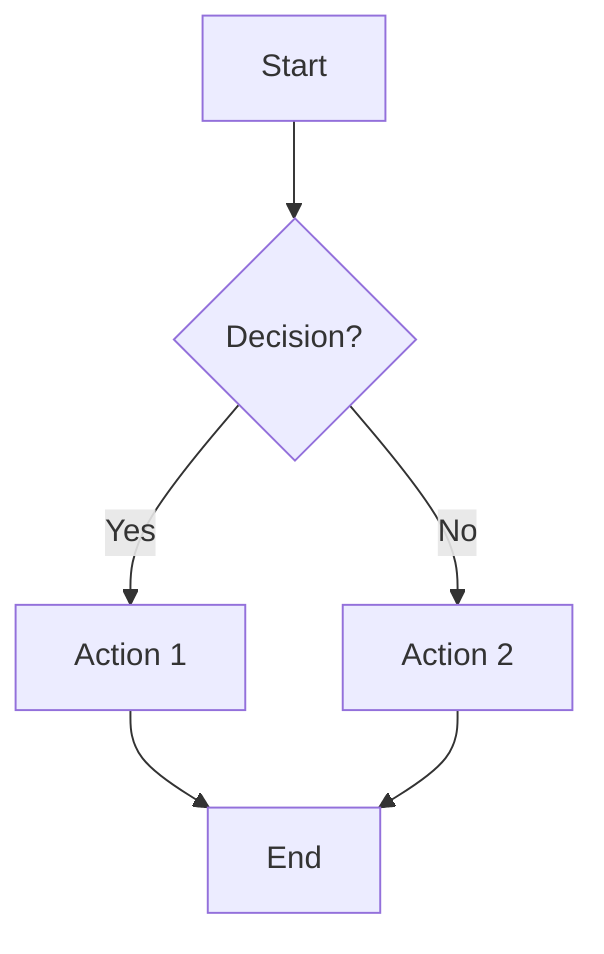

# SC Documentation Site

A modern, comprehensive documentation site built with MkDocs and Material theme for SC projects and team resources.

## 🌟 Features

- **Modern Design**: Clean, responsive layout with Material Design
- **Search Functionality**: Full-text search across all documentation
- **Dark/Light Mode**: Automatic theme switching based on system preference
- **Mobile Responsive**: Optimized for all device sizes
- **Code Highlighting**: Syntax highlighting for multiple languages
- **Interactive Elements**: Copy buttons, progress bars, and enhanced navigation
- **SEO Optimized**: Proper meta tags and structured content
- **Version Control**: Git integration with revision dates
- **Custom Styling**: Branded design with custom CSS and JavaScript

## 📁 Project Structure

```
sc-website/
├── mkdocs.yml                 # MkDocs configuration
├── requirements.txt           # Python dependencies
├── README.md                 # This file
├── docs/                     # Documentation source
│   ├── index.md             # Home page
│   ├── getting-started/     # Getting started guides
│   ├── user-guide/          # User documentation
│   ├── api/                 # API documentation
│   ├── development/         # Development guides
│   ├── deployment/          # Deployment guides
│   ├── team/                # Team resources
│   ├── stylesheets/         # Custom CSS
│   └── javascripts/         # Custom JavaScript
└── site/                    # Generated site (after build)
```

## 🚀 Quick Start

### Prerequisites

- **Python 3.8+** - [Download Python](https://www.python.org/downloads/)
- **pip** - Python package installer

### Installation

1. **Clone the repository**:
   ```bash
   git clone https://github.com/your-username/sc-website.git
   cd sc-website
   ```

2. **Create virtual environment**:
   ```bash
   python -m venv venv
   
   # Activate virtual environment
   # On Windows:
   venv\Scripts\activate
   # On macOS/Linux:
   source venv/bin/activate
   ```

3. **Install dependencies**:
   ```bash
   pip install -r requirements.txt
   ```

4. **Start development server**:
   ```bash
   mkdocs serve
   ```

5. **Open your browser** and navigate to `http://127.0.0.1:8000`

## 📝 Usage

### Development

```bash
# Start development server with live reload
mkdocs serve

# Start development server on specific port
mkdocs serve -a 0.0.0.0:8080

# Start development server with specific config
mkdocs serve -f mkdocs.yml
```

### Building

```bash
# Build the site
mkdocs build

# Build to specific directory
mkdocs build -d ../my-site

# Clean build (remove old files)
mkdocs build --clean
```

### Deployment

```bash
# Deploy to GitHub Pages
mkdocs gh-deploy

# Deploy to specific branch
mkdocs gh-deploy -b gh-pages

# Deploy with custom message
mkdocs gh-deploy -m "Update documentation"
```

## ⚙️ Configuration

### MkDocs Configuration (`mkdocs.yml`)

The main configuration file includes:

- **Site Information**: Name, description, author
- **Theme Settings**: Material theme with custom features
- **Navigation**: Hierarchical navigation structure
- **Plugins**: Search, git revision dates, minification
- **Markdown Extensions**: Enhanced markdown features
- **Custom Assets**: CSS and JavaScript files

### Customization

#### Styling

Edit `docs/stylesheets/extra.css` to customize:

- Colors and themes
- Typography
- Layout and spacing
- Component styling
- Dark mode adjustments

#### Functionality

Edit `docs/javascripts/extra.js` to add:

- Interactive features
- Search enhancements
- Navigation improvements
- Analytics integration
- Custom components

## 📚 Content Organization

### Documentation Sections

1. **Getting Started**
   - Quick Start Guide
   - Installation Instructions
   - Configuration Setup

2. **User Guide**
   - Feature Documentation
   - Usage Examples
   - Best Practices

3. **API Reference**
   - Endpoint Documentation
   - Authentication
   - Request/Response Examples

4. **Development**
   - Setup Instructions
   - Contributing Guidelines
   - Testing Procedures

5. **Deployment**
   - Infrastructure Setup
   - CI/CD Configuration
   - Monitoring and Maintenance

6. **Team Resources**
   - Guidelines and Standards
   - Processes and Workflows
   - Tools and References

### Writing Guidelines

#### Markdown Best Practices

- Use clear, descriptive headings
- Include code examples with syntax highlighting
- Add admonitions for important information
- Use tables for structured data
- Include links to related content

#### Content Structure

```markdown
# Page Title

Brief description of the page content.

## Section 1

Content for the first section.

### Subsection 1.1

More detailed content.

## Section 2

Content for the second section.

!!! info "Important Note"
    This is an important piece of information.

!!! warning "Warning"
    This is a warning message.

!!! danger "Danger"
    This is a critical warning.

!!! tip "Tip"
    This is a helpful tip.
```

## 🎨 Custom Components

### Progress Bars

```html
<div class="sc-progress">
    <div class="sc-progress__bar" data-progress="75"></div>
</div>
```

### Callout Boxes

```html
<div class="sc-callout sc-callout--info">
    <strong>Info:</strong> This is an informational callout.
</div>

<div class="sc-callout sc-callout--success">
    <strong>Success:</strong> This is a success message.
</div>

<div class="sc-callout sc-callout--warning">
    <strong>Warning:</strong> This is a warning message.
</div>

<div class="sc-callout sc-callout--error">
    <strong>Error:</strong> This is an error message.
</div>
```

### Badges

```html
<span class="sc-badge sc-badge--primary">Primary</span>
<span class="sc-badge sc-badge--secondary">Secondary</span>
<span class="sc-badge sc-badge--success">Success</span>
<span class="sc-badge sc-badge--warning">Warning</span>
<span class="sc-badge sc-badge--error">Error</span>
```

### Cards

```html
<div class="sc-card">
    <h3>Card Title</h3>
    <p>Card content goes here.</p>
</div>
```

## 🔧 Advanced Features

### Mermaid Diagrams

```markdown

```

### Code Blocks with Line Numbers

```markdown
```python
def hello_world():
    print("Hello, World!")
    return True
```
```

### Tabbed Content

```markdown
=== "Python"
    ```python
    def hello():
        print("Hello from Python!")
    ```

=== "JavaScript"
    ```javascript
    function hello() {
        console.log("Hello from JavaScript!");
    }
    ```

=== "Bash"
    ```bash
    echo "Hello from Bash!"
    ```
```

### Task Lists

```markdown
- [x] Completed task
- [ ] Pending task
- [ ] Another pending task
```

## 🚀 Deployment Options

### GitHub Pages

```bash
# Deploy to GitHub Pages
mkdocs gh-deploy

# Deploy to specific branch
mkdocs gh-deploy -b docs
```

### Netlify

1. Connect your repository to Netlify
2. Set build command: `mkdocs build`
3. Set publish directory: `site`
4. Deploy automatically on push

### AWS S3 + CloudFront

```bash
# Build the site
mkdocs build

# Sync to S3
aws s3 sync site/ s3://your-bucket-name/

# Invalidate CloudFront cache
aws cloudfront create-invalidation --distribution-id YOUR_DISTRIBUTION_ID --paths "/*"
```

### Docker

```dockerfile
FROM python:3.9-slim

WORKDIR /app
COPY requirements.txt .
RUN pip install -r requirements.txt

COPY . .
RUN mkdocs build

EXPOSE 8000
CMD ["mkdocs", "serve", "-a", "0.0.0.0:8000"]
```

## 📊 Analytics and Monitoring

### Google Analytics

Add to `mkdocs.yml`:

```yaml
extra_javascript:
  - https://www.googletagmanager.com/gtag/js?id=GA_MEASUREMENT_ID
  - javascripts/analytics.js
```

Create `docs/javascripts/analytics.js`:

```javascript
window.dataLayer = window.dataLayer || [];
function gtag(){dataLayer.push(arguments);}
gtag('js', new Date());
gtag('config', 'GA_MEASUREMENT_ID');
```

### Search Analytics

The built-in search functionality provides:

- Search term tracking
- Popular search queries
- Search result analytics
- User behavior insights

## 🔒 Security Considerations

### Content Security Policy

Add CSP headers to your web server:

```
Content-Security-Policy: default-src 'self'; script-src 'self' 'unsafe-inline' https://www.googletagmanager.com; style-src 'self' 'unsafe-inline' https://fonts.googleapis.com; font-src 'self' https://fonts.gstatic.com;
```

### HTTPS Enforcement

- Always use HTTPS in production
- Redirect HTTP to HTTPS
- Use HSTS headers
- Secure cookie settings

## 🧪 Testing

### Local Testing

```bash
# Test the build process
mkdocs build --strict

# Test with different themes
mkdocs serve --theme readthedocs

# Test search functionality
mkdocs serve --no-livereload
```

### Automated Testing

```yaml
# .github/workflows/docs.yml
name: Documentation
on:
  push:
    branches: [ main ]
  pull_request:
    branches: [ main ]

jobs:
  build:
    runs-on: ubuntu-latest
    steps:
    - uses: actions/checkout@v2
    - name: Set up Python
      uses: actions/setup-python@v2
      with:
        python-version: 3.9
    - name: Install dependencies
      run: |
        python -m pip install --upgrade pip
        pip install -r requirements.txt
    - name: Build documentation
      run: mkdocs build --strict
    - name: Deploy to GitHub Pages
      if: github.ref == 'refs/heads/main'
      run: mkdocs gh-deploy
```

## 🤝 Contributing

### Adding Content

1. Create a new markdown file in the appropriate directory
2. Add the page to the navigation in `mkdocs.yml`
3. Follow the writing guidelines
4. Test locally with `mkdocs serve`
5. Submit a pull request

### Style Guide

- Use clear, concise language
- Include examples and code snippets
- Add appropriate admonitions
- Link to related content
- Keep content up-to-date

### Review Process

1. **Self-review**: Check your content for accuracy
2. **Peer review**: Have another team member review
3. **Technical review**: Ensure technical accuracy
4. **Final approval**: Get approval from maintainers

## 📈 Performance Optimization

### Build Optimization

- Use `--clean` flag for clean builds
- Minimize custom CSS and JavaScript
- Optimize images and assets
- Use CDN for external resources

### Runtime Optimization

- Enable gzip compression
- Use browser caching
- Minimize HTTP requests
- Optimize search indexing

## 🐛 Troubleshooting

### Common Issues

#### Build Errors

```bash
# Check MkDocs version
mkdocs --version

# Update MkDocs
pip install --upgrade mkdocs

# Check configuration
mkdocs build --strict
```

#### Search Not Working

- Ensure search plugin is enabled
- Check JavaScript console for errors
- Verify content is properly indexed
- Test with different browsers

#### Styling Issues

- Clear browser cache
- Check CSS file paths
- Verify custom CSS syntax
- Test in different browsers

### Getting Help

- **Documentation**: Check MkDocs documentation
- **GitHub Issues**: Report bugs or request features
- **Community**: Ask questions in MkDocs community
- **Team Support**: Contact the team for assistance

## 📄 License

This project is licensed under the MIT License - see the [LICENSE](LICENSE) file for details.

## 🙏 Acknowledgments

- [MkDocs](https://www.mkdocs.org/) - Static site generator
- [Material for MkDocs](https://squidfunk.github.io/mkdocs-material/) - Theme
- [PyMdown Extensions](https://facelessuser.github.io/pymdown-extensions/) - Markdown extensions

---

**Happy Documenting! 📚** 