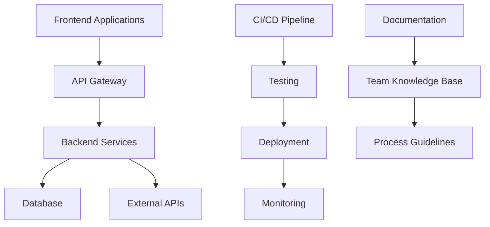

# Welcome to SC Documentation

Welcome to the comprehensive documentation for SC projects and team resources. This site serves as the central hub for all technical documentation, guides, and team processes.

## 🚀 Quick Start

If you're new here, start with these essential guides:

- **[Quick Start Guide](getting-started/quick-start.md)** - Get up and running in minutes
- **[Installation Guide](getting-started/installation.md)** - Set up your development environment
- **[Configuration](getting-started/configuration.md)** - Configure the system for your needs
- **[Document Creation Guide](getting-started/document-creation.md)** - Learn how to create new documents
- **[Document Update Guide](getting-started/document-updates.md)** - Learn how to update existing documents

## 📚 Documentation Sections

### For Users
- **[User Guide](user-guide/)** - Learn how to use our products and services
- **[API Reference](api/)** - Complete API documentation and examples
- **[Examples](user-guide/examples.md)** - Practical examples and use cases

### For Developers
- **[Development Setup](development/setup.md)** - Set up your development environment
- **[Contributing Guidelines](development/contributing.md)** - How to contribute to our projects
- **[Testing Guide](development/testing.md)** - Testing procedures and best practices

### For DevOps
- **[Deployment Guide](deployment/)** - Deploy applications to production
- **[AWS Setup](deployment/aws-setup.md)** - AWS infrastructure configuration
- **[CI/CD Pipeline](deployment/ci-cd.md)** - Continuous integration and deployment

### For Team Members
- **[Team Guidelines](team/guidelines.md)** - Team standards and best practices
- **[Processes](team/processes.md)** - Team workflows and procedures
- **[Resources](team/resources.md)** - Useful tools and references

## 🔍 Search

Use the search functionality in the top navigation to quickly find what you're looking for. The search indexes all documentation content and provides instant results.

## 📝 Contributing

Found an error or want to improve the documentation? 

1. Click the **Edit this page** button on any page
2. Make your changes
3. Submit a pull request

For more details, see our [Contributing Guidelines](development/contributing.md).

## 🆕 Recent Updates

!!! info "Latest Changes"
    - **2024-01-15**: Added comprehensive API documentation
    - **2024-01-10**: Updated deployment guides for AWS
    - **2024-01-05**: New team guidelines and processes

## 📞 Support

Need help? Here are your options:

- **Documentation**: Search this site for answers
- **GitHub Issues**: Report bugs or request features
- **Team Chat**: Ask questions in our team channels
- **Email**: Contact the team directly

## 🏗️ Architecture Overview

## 🎯 Key Features

- **Comprehensive Coverage**: From quick start to advanced topics
- **Searchable**: Find information quickly with full-text search
- **Version Controlled**: All documentation is version controlled
- **Team Focused**: Built for team collaboration and knowledge sharing
- **Always Up-to-Date**: Regular updates and maintenance

---

*This documentation is maintained by the SC Team. Last updated: January 2024* 